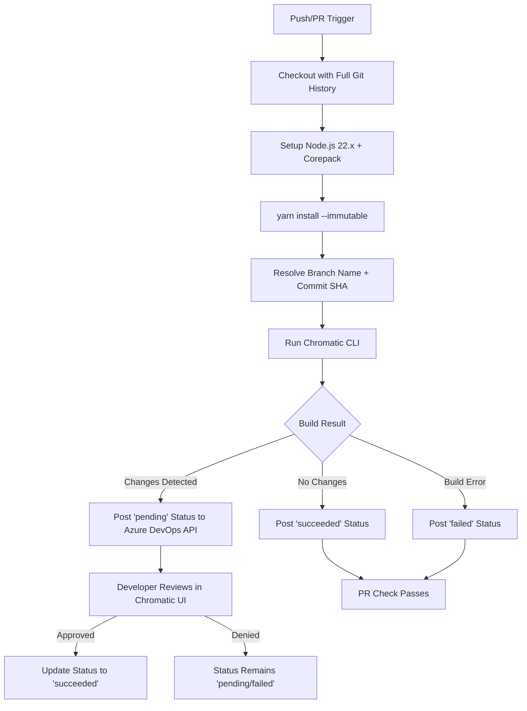

# feat: Chromatic Azure DevOps Pipeline Integration

## Overview

Set up and validate a Chromatic visual regression testing pipeline running in Azure DevOps Pipelines, using this design system repository as a test bed. The goal is to map the current boundaries of Chromatic's Azure DevOps support — what works out of the box, what requires workarounds, and what gaps exist that need filling for official support. The existing GitHub Actions Chromatic workflow (`.github/workflows/chromatic.yml`) serves as the reference implementation.

## Problem Statement

Chromatic does not officially support Azure DevOps as a CI provider. While the underlying `env-ci` library (v11.1.0, bundled in Chromatic CLI v17.x) detects Azure Pipelines via the `BUILD_BUILDURI` environment variable, several integration points are missing or broken:

1. **PR status check integration** — Chromatic posts commit statuses to GitHub, GitLab, and Bitbucket via their respective APIs, but has no integration with Azure DevOps' commit/PR status APIs.
2. **PR commenting** — Visual diff summaries posted as PR comments on other platforms are absent.
3. **Merge commit SHA in PR builds** — During PR-triggered Azure builds, `BUILD_SOURCEVERSION` is a synthetic merge commit created by Azure, not the actual source branch HEAD. Unlike GitHub Actions and Travis (which get explicit merge-commit handling in the CLI), Azure gets no such handling. This can break baseline detection and attribute builds to phantom commits.
4. **Repository slug extraction** — The `env-ci` Azure detection does not extract a repository slug (`undefined`). Worse, the git remote URL format for Azure DevOps (`ssh.dev.azure.com:v3/org/project/repo`) has three path segments, not the `owner/repo` format Chromatic expects — so fallback slug extraction also fails.
5. **No SSO/identity integration** — Team members cannot authenticate via Azure AD; must use email/password.

This project is already hosted on Azure Repos (`ssh.dev.azure.com:v3/arxavasquez/test-azure-repo/test-azure-repo`) and has a working (but disabled) GitHub Actions Chromatic workflow. It's the ideal test bed.

## Proposed Solution

Create an `azure-pipelines.yml` pipeline that replicates the GitHub Actions Chromatic workflow, systematically validating each integration point and documenting what works, what breaks, and what needs Chromatic-side engineering.

## Technical Approach

### Architecture



### env-ci Azure Detection (from CLI source)

The bundled `env-ci` library detects Azure Pipelines and extracts:

```javascript
configuration({ env }) {
  let pr = env.SYSTEM_PULLREQUEST_PULLREQUESTID;
  let isPr = !!pr;
  return {
    service: 'azurePipelines',
    commit: env.BUILD_SOURCEVERSION,
    branch: isPr
      ? stripRefsHeads(env.SYSTEM_PULLREQUEST_TARGETBRANCH)  // target, not source
      : stripRefsHeads(env.BUILD_SOURCEBRANCH),
    prBranch: isPr
      ? stripRefsHeads(env.SYSTEM_PULLREQUEST_SOURCEBRANCH)
      : undefined,
    // NOTE: no slug extraction — slug is undefined
  };
}
```

Chromatic's `getCommitAndBranch` function then picks `prBranch` first (if available), so branch name resolution is actually correct for PR builds — the feature branch name is used, not `merge`. The real problems are the commit SHA and the missing slug.

### What Works Today (No Chromatic Changes Needed)

| Feature | Status | Notes |
|---|---|---|
| CI detection | ✅ Works | `BUILD_BUILDURI` detected, `service: 'azurePipelines'` |
| Snapshot upload | ✅ Works | Storybook builds, snapshots uploaded to Chromatic API |
| Branch detection (push) | ✅ Works | `BUILD_SOURCEBRANCH` stripped of `refs/heads/` prefix |
| Branch detection (PR) | ✅ Works | `SYSTEM_PULLREQUEST_SOURCEBRANCH` used as `prBranch` |
| Baseline detection | ✅ Works | Git-history-based, not CI-provider-dependent |
| TurboSnap | ✅ Works | Depends on git diff, not CI provider |
| Build failure propagation | ✅ Works | Non-zero exit codes propagate to pipeline |

### What Doesn't Work (Needs Engineering or Workarounds)

| Feature | Status | Issue |
|---|---|---|
| PR status checks | ❌ Broken | No Azure DevOps Status API integration |
| PR commenting | ❌ Broken | No Azure DevOps PR Thread API integration |
| Commit SHA (PR builds) | ⚠️ Wrong | `BUILD_SOURCEVERSION` is synthetic merge commit, not source HEAD |
| Repository slug | ⚠️ Missing | Not extracted by env-ci; git remote format incompatible |
| Squash merge baselines | ⚠️ Workaround | Needs `--auto-accept-changes` on main |
| SSO/identity | ❌ Broken | No Azure AD integration |

### Implementation Phases

#### Phase 1: Pipeline Foundation

**Goal:** Get Chromatic running in Azure Pipelines with push-triggered builds.

**Tasks:**
- Create `azure-pipelines.yml`:

```yaml
trigger:
  branches:
    include:
      - main
      - feature/*

pool:
  vmImage: 'ubuntu-latest'

steps:
  - checkout: self
    displayName: 'Checkout with full git history'
    fetchDepth: 0
    clean: true

  - task: UseNode@1
    displayName: 'Install Node.js 22.x'
    inputs:
      version: '22.x'

  - task: Bash@3
    displayName: 'Enable Corepack'
    inputs:
      targetType: 'inline'
      script: |
        set -e
        npm uninstall -g yarn
        corepack enable

  - task: Cache@2
    displayName: 'Cache Yarn packages'
    inputs:
      key: 'yarn | "$(Agent.OS)" | yarn.lock'
      restoreKeys: |
        yarn | "$(Agent.OS)"
      path: '.yarn/cache'

  - script: yarn install --immutable
    displayName: 'Install dependencies'

  - task: CmdLine@2
    displayName: 'Run Chromatic'
    inputs:
      script: npx chromatic --exit-zero-on-changes
    env:
      CHROMATIC_PROJECT_TOKEN: $(CHROMATIC_PROJECT_TOKEN)
```

- Restore `chromatic.config.json` with defaults:

```json
{
  "$schema": "https://www.chromatic.com/config-file.schema.json",
  "onlyChanged": true,
  "autoAcceptChanges": "main"
}
```

- Remove hardcoded project token from `package.json` chromatic script
- Create `CHROMATIC_PROJECT_TOKEN` as a pipeline secret variable in Azure DevOps UI

**Success criteria:**
- [ ] Pipeline triggers on push to any included branch
- [ ] Storybook builds successfully in Azure Pipelines
- [ ] Chromatic receives the build and shows it in the UI
- [ ] Build shows correct branch name and commit SHA (for push builds)
- [ ] Baseline detection finds ancestor builds via git history

**Estimated effort:** 1-2 hours

#### Phase 2: PR Build Support

**Goal:** Validate PR-triggered builds with correct branch context and investigate the merge commit SHA issue.

**Tasks:**
- Add `pr:` trigger to `azure-pipelines.yml`:

```yaml
pr:
  branches:
    include:
      - main
  drafts: false
```

- Add branch/commit resolution step to handle the merge commit SHA issue:

```yaml
- task: Bash@3
  displayName: 'Resolve Chromatic git context'
  inputs:
    targetType: 'inline'
    script: |
      if [ -n "$SYSTEM_PULLREQUEST_SOURCEBRANCH" ]; then
        BRANCH="${SYSTEM_PULLREQUEST_SOURCEBRANCH#refs/heads/}"
        # Resolve actual source branch HEAD (not merge commit)
        SOURCE_SHA=$(git rev-parse "origin/${BRANCH}" 2>/dev/null || echo "$BUILD_SOURCEVERSION")
        echo "PR build detected: branch=$BRANCH, source_sha=$SOURCE_SHA, merge_sha=$BUILD_SOURCEVERSION"
        echo "##vso[task.setvariable variable=CHROMATIC_RESOLVED_BRANCH]$BRANCH"
        echo "##vso[task.setvariable variable=CHROMATIC_RESOLVED_SHA]$SOURCE_SHA"
      else
        echo "Push build: branch=$BUILD_SOURCEBRANCHNAME, sha=$BUILD_SOURCEVERSION"
        echo "##vso[task.setvariable variable=CHROMATIC_RESOLVED_BRANCH]$BUILD_SOURCEBRANCHNAME"
        echo "##vso[task.setvariable variable=CHROMATIC_RESOLVED_SHA]$BUILD_SOURCEVERSION"
      fi
```

- Pass resolved values to Chromatic via env vars:

```yaml
- task: CmdLine@2
  displayName: 'Run Chromatic'
  inputs:
    script: npx chromatic --exit-zero-on-changes
  env:
    CHROMATIC_PROJECT_TOKEN: $(CHROMATIC_PROJECT_TOKEN)
    CHROMATIC_BRANCH: $(CHROMATIC_RESOLVED_BRANCH)
    CHROMATIC_SHA: $(CHROMATIC_RESOLVED_SHA)
    CHROMATIC_SLUG: $(System.TeamProject)/$(Build.Repository.Name)
```

- Test with actual PR to verify visual diff against baseline
- Validate TurboSnap behavior
- **Investigate:** Does the synthetic merge commit SHA cause baseline detection issues? Does overriding with `CHROMATIC_SHA` fix it?
- **Investigate:** Does the constructed slug (`project/repo`) work correctly in Chromatic UI?

**Success criteria:**
- [ ] PR trigger fires on PR creation/update
- [ ] Chromatic receives correct source branch name (verified in UI)
- [ ] Commit SHA points to actual source HEAD, not merge commit
- [ ] Visual diff computed against correct baseline
- [ ] TurboSnap identifies affected stories correctly
- [ ] Dual-trigger behavior documented (push + PR on same commit)

**Estimated effort:** 2-3 hours

#### Phase 3: Status Check Integration

**Goal:** Post Chromatic build status back to Azure DevOps PRs.

This is the primary gap for official support. Two approaches to test:

**Approach A: Pipeline post-step (workaround)**

Add a step after Chromatic that posts status via Azure DevOps REST API:

```yaml
- task: Bash@3
  displayName: 'Post Chromatic status to Azure DevOps'
  condition: always()
  env:
    SYSTEM_ACCESSTOKEN: $(System.AccessToken)
  inputs:
    targetType: 'inline'
    script: |
      # Parse Chromatic output for build URL and status
      # (requires Chromatic to output machine-readable results)
      
      STATUS="succeeded"  # or "failed" based on Chromatic exit code
      DESCRIPTION="Chromatic: Visual tests passed"
      TARGET_URL="https://www.chromatic.com/build?appId=..."
      
      curl -s -X POST \
        -u ":${SYSTEM_ACCESSTOKEN}" \
        -H "Content-Type: application/json" \
        -d "{
          \"state\": \"${STATUS}\",
          \"description\": \"${DESCRIPTION}\",
          \"context\": {\"name\": \"chromatic\", \"genre\": \"visual-testing\"},
          \"targetUrl\": \"${TARGET_URL}\"
        }" \
        "${SYSTEM_TEAMFOUNDATIONCOLLECTIONURI}${SYSTEM_TEAMPROJECT}/_apis/git/repositories/${BUILD_REPOSITORY_ID}/commits/${BUILD_SOURCEVERSION}/statuses?api-version=7.1"
```

**Approach B: Chromatic service-side integration (official support)**

Chromatic's backend posts status directly via Azure DevOps API, similar to GitHub/GitLab/Bitbucket integrations. Requires:
- Azure DevOps OAuth app or PAT stored in Chromatic
- Mapping Chromatic build outcomes → Azure status states
- PR Status API for PR-scoped statuses

**Tasks:**
- Implement Approach A as proof-of-concept
- Configure Azure branch policy requiring `visual-testing/chromatic` status
- Verify `System.AccessToken` has `vso.code_status` scope (may need "Contribute to pull requests" permission on the Build Service identity)
- Test full flow: PR → Chromatic → status → merge gate
- Document what Approach B would need for official Chromatic support

**Success criteria:**
- [ ] Commit status appears on Azure DevOps commits
- [ ] PR shows status check with link to Chromatic build
- [ ] Branch policy blocks merge when Chromatic detects changes
- [ ] Branch policy allows merge when build succeeds
- [ ] Permissions requirements documented

**Estimated effort:** 3-4 hours

#### Phase 4: Edge Cases and Boundary Testing

**Goal:** Systematically test known problem areas and document findings.

**Test matrix:**

| Test Case | Expected Behavior | Flags/Config |
|---|---|---|
| Squash merge to main | Baseline accepted automatically | `--auto-accept-changes main` |
| Rebase merge to main | Same as squash | `--auto-accept-changes main` |
| Regular merge to main | Baseline linked via ancestry | None needed |
| Missing `fetchDepth: 0` | Build succeeds but no baseline diff | Remove and verify error |
| `.git/shallow` persists (self-hosted agent) | `clean: true` prevents this | Test with/without `clean` |
| Storybook build failure | Pipeline fails, Chromatic reports error | Intentionally break build |
| Network timeout | CLI retries, eventual failure | Lower `CHROMATIC_TIMEOUT` |
| Concurrent PR builds | Each identifies own branch/baseline | Push to multiple branches |
| Draft PR (with `drafts: false`) | Pipeline does not trigger | Create draft PR |
| `--repository-slug` omitted | Test slug in Chromatic UI | Remove `CHROMATIC_SLUG` |
| `CHROMATIC_INDEX_URL` to staging | Builds go to staging instance | Set env var |
| `--only-changed` accuracy | Only changed stories tested | Make targeted changes |
| Large Storybook (many stories) | Build timeout behavior | Increase story count |

**Success criteria:**
- [ ] Each test case documented with actual vs. expected behavior
- [ ] Recovery procedures for each failure mode
- [ ] Boundary matrix produced: feature × status (works / workaround / broken / needs engineering)

**Estimated effort:** 3-4 hours

## Alternative Approaches Considered

### 1. Use @workleap/chromado (Third-Party Wrapper)

**What:** Apache 2.0 community library (245+ commits, actively maintained) wrapping Chromatic CLI for Azure DevOps. Adds PR commenting via `CHROMATIC_PULL_REQUEST_COMMENT_ACCESS_TOKEN` and proper Azure variable mapping.

**Why not primary:** Goal is to understand raw CLI boundaries, not a third-party abstraction. Chromado is valuable as a reference for what workarounds the community needed — and as input for official support design.

**Action:** Test alongside raw CLI in Phase 4 for comparison.

### 2. Keep GitHub Actions (Dual CI)

**Why rejected:** The repo is on Azure Repos; GitHub Actions workflows won't execute. Also defeats the purpose of testing Azure DevOps integration.

### 3. Custom CI Provider Mode (Manual Overrides Only)

**Why partially adopted:** Manual `CHROMATIC_BRANCH` / `CHROMATIC_SHA` / `CHROMATIC_SLUG` env vars are used in Phase 2 as the recommended approach, since env-ci's auto-detection has the merge commit SHA and slug issues.

## System-Wide Impact

### Interaction Graph

1. Azure DevOps push/PR event → Azure Pipelines agent spins up
2. Agent: checkout → Node setup → Yarn install → Storybook build
3. Chromatic CLI → env-ci detects `azurePipelines` → extracts branch/commit/PR context
4. CLI builds/uploads snapshots → Chromatic API processes build → returns result
5. CLI exits with status code → pipeline step succeeds/fails
6. (Phase 3) Post-step → Azure DevOps REST API for commit/PR status
7. (Phase 3) Branch policy evaluates status → allows/blocks merge

### Error & Failure Propagation

- **Storybook build failure** → CLI exits non-zero → pipeline step fails → pipeline fails (clear error in logs)
- **Chromatic upload failure** → CLI retries (5x by default) → eventual timeout → non-zero exit
- **Status posting failure** → Post-step fails → pipeline step may fail (but Chromatic build still exists in UI)
- **Shallow git history** → Chromatic can't find baseline → builds without diff → may produce false "no changes" or error
- **Wrong commit SHA (merge commit)** → Build attributed to phantom commit → baseline detection may fail silently → visual diff against wrong base

### State Lifecycle Risks

- **Orphaned baselines after squash merge:** New main commits have no branch ancestry → Chromatic can't trace lineage → `--auto-accept-changes` is the only workaround
- **Stale shallow clones on self-hosted agents:** `.git/shallow` persists between runs → `fetchDepth: 0` ignored → baseline detection fails silently. Mitigation: `clean: true` on checkout step
- **Dual-trigger double builds:** Push + PR triggers on same commit → two Chromatic builds for one change → wasted compute, potential race condition on status posting

### API Surface Parity

| Feature | GitHub | GitLab | Bitbucket | Azure DevOps |
|---|---|---|---|---|
| CI detection | ✅ | ✅ | ✅ | ✅ (env-ci) |
| PR status checks | ✅ Native | ✅ Native | ✅ Native | ❌ Manual |
| PR comments | ✅ Native | ✅ Native | ✅ Native | ❌ Manual |
| Merge commit handling | ✅ Explicit | N/A | N/A | ❌ None |
| Slug extraction | ✅ | ✅ | ✅ | ❌ Missing |
| SSO/identity | ✅ | ✅ | ✅ | ❌ None |
| GitHub Action/Extension | ✅ `chromaui/action` | N/A | N/A | ❌ None |

### Integration Test Scenarios

1. **PR with visual changes** → Chromatic detects diff → status `pending` on PR → developer approves in Chromatic → status updates to `succeeded` → PR unblocked
2. **PR with no visual changes** → Chromatic detects no diff → status `succeeded` immediately → PR unblocked
3. **Main branch after squash merge** → New commit with no ancestry → `--auto-accept-changes` accepts as new baseline
4. **Concurrent PR builds** → Two PRs open simultaneously → each correctly identifies own branch/baseline → no cross-contamination
5. **Storybook build failure in PR** → CLI fails → status `failed` with error description → PR blocked

## Acceptance Criteria

### Functional Requirements

- [ ] `azure-pipelines.yml` exists and runs successfully on push to configured branches
- [ ] Pipeline triggers on PR creation/update targeting `main`
- [ ] Chromatic CLI detects `service: 'azurePipelines'`
- [ ] Builds appear in Chromatic UI with correct branch name and commit SHA
- [ ] Visual diffs computed against correct baseline
- [ ] TurboSnap correctly identifies affected stories
- [ ] `chromatic.config.json` exists with `onlyChanged` and `autoAcceptChanges` configured
- [ ] Project token stored as pipeline secret, not hardcoded in `package.json`
- [ ] Merge commit SHA issue documented with workaround (or resolved)
- [ ] Repository slug passed via `CHROMATIC_SLUG` env var

### Non-Functional Requirements

- [ ] Pipeline completes within reasonable time (< 10 minutes for current story set)
- [ ] Yarn cache utilized between builds
- [ ] Full git history available for baseline detection
- [ ] Secrets never exposed in logs (masked with `***`)
- [ ] Pipeline YAML is well-documented with `displayName` on every step

### Quality Gates

- [ ] All phases validated with actual pipeline runs in Azure DevOps
- [ ] Boundary matrix produced: feature × status for every Chromatic CI feature
- [ ] Comparison table: GitHub Actions vs Azure DevOps feature parity (the API Surface Parity table above, validated)
- [ ] Edge cases from Phase 4 tested and documented with actual results

## Success Metrics

- **Pipeline reliability:** Push-triggered builds succeed >95% (excluding intentional failure tests)
- **Feature coverage:** Every row in the "What Works / What Doesn't Work" tables validated with real pipeline runs
- **Gap identification:** Clear engineering requirements list for official Chromatic Azure DevOps support
- **Time-to-feedback:** Pipeline completion within 2x of GitHub Actions equivalent

## Dependencies & Prerequisites

### Required Before Starting

- [ ] Azure DevOps project access with pipeline creation permissions (`arxavasquez/test-azure-repo`)
- [ ] `CHROMATIC_PROJECT_TOKEN` value (currently `chpt_48d650420a3234a` in `package.json` — move to pipeline variable)
- [ ] Decision on `CHROMATIC_INDEX_URL`: target production or staging Chromatic? (current GitHub workflow points to `https://chromatic-www-pr-11663.herokuapp.com`, a Heroku PR deployment)
- [ ] (Phase 3) Verify Build Service identity has "Contribute to pull requests" permission for Status API

### Known Blockers

1. **`chromatic.config.json` does not exist** — The `package.json` `chromatic` script references `--config-file 'chromatic.config.json'` but the file was deleted (see `docs/plans/2026-06-29-001-fix-restore-storybook-config-plan.md`). Must restore or update the script.
2. **Hardcoded project token in `package.json`** — Security concern. Must be removed before pipeline goes live.

## Risk Analysis & Mitigation

| Risk | Likelihood | Impact | Mitigation |
|---|---|---|---|
| Merge commit SHA breaks baseline detection in PR builds | High | High | Override with `CHROMATIC_SHA` resolved from `origin/<branch>` in script step |
| Repository slug extraction fails for Azure remote URLs | High | Medium | Pass `CHROMATIC_SLUG` explicitly as `$(System.TeamProject)/$(Build.Repository.Name)` |
| Squash merges break baseline chain on main | High | High | Configure `--auto-accept-changes main` in `chromatic.config.json` |
| Corepack doesn't activate Yarn 4.9.1 (global Yarn takes precedence) | Medium | High | Remove global Yarn first: `npm uninstall -g yarn` before `corepack enable` |
| Shallow git history persists on cached/self-hosted agents | Medium | High | Use `clean: true` on checkout + fallback `git fetch --unshallow` step |
| `System.AccessToken` lacks Status API permissions | Medium | Medium | Document required permission grant; fallback to PAT |
| Dual triggers (push + PR) create duplicate Chromatic builds | Medium | Low | Configure `trigger:` for main only, `pr:` for feature branches |
| `CHROMATIC_INDEX_URL` pointing to torn-down Heroku deployment | Low | High | Do not carry GitHub workflow's index URL into Azure pipeline; use production |

## Future Considerations

Findings from this exploration feed directly into official Chromatic Azure DevOps support:

1. **CLI changes needed:**
   - Azure-specific merge commit handling in `getCommitAndBranch` (like GitHub/Travis get)
   - Azure DevOps slug extraction in env-ci (upstream patch: `SYSTEM_TEAMPROJECT/BUILD_REPOSITORY_NAME`)
   - Native Azure DevOps Status API integration (server-side, like GitHub)
   - Azure DevOps PR Thread API integration for PR commenting

2. **Documentation:**
   - Official Azure Pipelines setup guide (expand `chromatic.com/docs/azure-pipelines/`)
   - Corepack + Yarn 4 on Azure agents gotcha
   - `fetchDepth: 0` + `clean: true` requirement

3. **Potential Azure DevOps extension:**
   - Equivalent of `chromaui/action` for Azure DevOps Marketplace
   - Would abstract env var mapping, status posting, and edge case handling

4. **Community library evaluation:**
   - Review `@workleap/chromado` patterns for adoption or inspiration
   - Determine overlap vs. differentiation for official support

## Documentation Plan

- [ ] Update this plan with actual test results after each phase
- [ ] Produce boundary matrix: feature × status (works / workaround / broken / needs engineering)
- [ ] Document Azure DevOps env var mapping for Chromatic docs team
- [ ] Capture corepack workaround for Azure agents knowledge base
- [ ] Write up merge commit SHA issue with recommended CLI fix

## Sources & References

### Internal References

- Reference Chromatic workflow: `.github/workflows/chromatic.yml:1-31`
- Azure deploy workflow: `.github/workflows/main_design-system.yml:1-65`
- Package configuration: `package.json:13` (chromatic script with hardcoded token)
- Storybook config: `.storybook/main.ts`
- Prior incident: `docs/plans/2026-06-29-001-fix-restore-storybook-config-plan.md`
- env-ci Azure detection: `node_modules/chromatic/dist/node-src-NjW8_TQU.cjs` (bundled env-ci)

### External References

- [Chromatic Azure Pipelines docs](https://www.chromatic.com/docs/azure-pipelines/)
- [Chromatic Custom CI Provider docs](https://www.chromatic.com/docs/custom-ci-provider/)
- [Chromatic FAQ: Azure DevOps](https://www.chromatic.com/docs/faq/chromatic-azure-devops/)
- [Chromatic config file schema](https://www.chromatic.com/config-file.schema.json)
- [Azure Pipelines predefined variables](https://learn.microsoft.com/en-us/azure/devops/pipelines/build/variables)
- [Azure DevOps REST API: Commit Statuses](https://learn.microsoft.com/en-us/rest/api/azure/devops/git/statuses/create)
- [Azure DevOps REST API: PR Statuses](https://learn.microsoft.com/en-us/rest/api/azure/devops/git/pull-request-statuses/create)
- [Workleap Chromado](https://github.com/workleap/wl-chromado) — Community Azure DevOps + Chromatic bridge
- [env-ci library](https://github.com/semantic-release/env-ci) — CI detection used by Chromatic CLI
- [Chromatic CLI source](https://github.com/chromaui/chromatic-cli)

### Key Open Questions

1. **Merge commit SHA:** Should the CLI add Azure-specific handling in `getCommitAndBranch` to resolve the actual source HEAD (like it does for GitHub/Travis)? Or is the `CHROMATIC_SHA` override sufficient as the documented approach?

2. **Repository slug format:** Azure DevOps has a three-level hierarchy (`org/project/repo`). Should the slug be `project/repo`, `org/repo`, or the full three-level path? Does this need an env-ci upstream patch?

3. **Status check implementation:** Should official support implement status posting server-side (Chromatic backend → Azure DevOps API) or client-side (CLI post-step → Azure DevOps API via `System.AccessToken`)?

4. **`CHROMATIC_INDEX_URL`:** Should the Azure pipeline target production Chromatic or a staging instance with Azure support changes?

5. **Dual-trigger strategy:** Recommend `trigger:` on main only + `pr:` for feature branches to avoid double builds? Or let both fire and rely on Chromatic deduplication?
